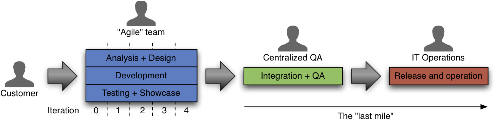

!SLIDE new-chapter center

# What is  <i>Continuous Delivery</i>?

!SLIDE

# The capability to reliably release  software to production on demand
# &nbsp;

!SLIDE

# The capability to reliably release  software to production on demand
# **with confidence**

!SLIDE

# Agile in a Nutshell

~~~SECTION:notes~~~

Manifesto for Agile Software Development
We are uncovering better ways of developing
software by doing it and helping others do it.
Through this work we have come to value:
Individuals and interactions over processes and tools
Working software over comprehensive documentation
Customer collaboration over contract negotiation
Responding to change over following a plan
That is, while there is value in the items on
the right, we value the items on the left more.

Kent Beck
Mike Beedle
Arie van Bennekum
Alistair Cockburn
Ward Cunningham
Martin Fowler

James Grenning
Jim Highsmith
Andrew Hunt
Ron Jeffries
Jon Kern
Brian Marick

Robert C. Martin
Steve Mellor
Ken Schwaber
Jeff Sutherland
Dave Thomas

http://agilemanifesto.org/

Done on a meeting at a ski trip.

~~~ENDSECTION~~~

!SLIDE subsection

# Manifesto for   Agile Software Development
## Our highest priority is to satisfy the customer  
through early and continuous delivery
  of valuable software.

!SLIDE

How long would it take your organisation 
to deploy a change that involves 
just one single line of code.

Do you do this on a repeatable, reliable basis?

!SLIDE incremental

# Continuous Delivery

* Software always production ready
* Releases tied to business needs, not operational constraints

!SLIDE incremental

# What Continuous Delivery is not

* Continuous Integration
* Continuous Deployment
* Deployment Tools

!SLIDE incremental

# Benefits for the Business

* Validate business plan, faster earlier
* Costs are more predictable
* Can respond to market demands

!SLIDE incremental

# Benefits for IT

* Less risk per release
* Feedback on development process

!SLIDE

<b>Fast, automated feedback</b> on the <b>production readiness</b> of your application <b>every</b> time there is a <b>change</b> - to code, infrastructure, or configuration
