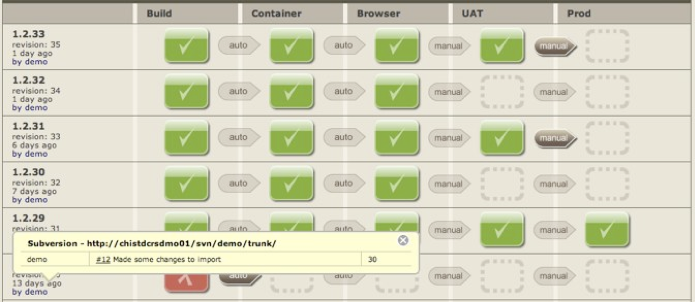

!SLIDE new-chapter

# Principles

!SLIDE

# Principles

create a repeatable, reliable process for releasing software

~~~SECTION:notes~~~

* Provisioning boxes
Infrastructure as Code

* Deployments
Version control / Manage source code
Code Reviews

* DB migrations
DBdeploy

* Monitoring
"We find a lot of bugs through production monitoring that we would have
never concieved of writing tests for" – Mike Brittain, Etsy

* Visibility

"Anything that can be measured can be improved" - Michael Dell, Dell Computers

business metrics
technical metrics
correlation

~~~ENDSECTION~~~

!SLIDE incremental

# Principles

* automate almost everything
* build, deploy, test, release
* manual testing, approvals
* use humans for high value stuff

~~~SECTION:notes~~~

automate build, deploy, test, release
can’t automate manual testing
approvals are still necessary
do it incrementally!

~~~ENDSECTION~~~

!SLIDE incremental

# Principles

* keep everything in version control

~~~SECTION:notes~~~

including middleware, dependencies and infrastructure config
you should be able to sit down at a workstation, check out source code, and type a single command to build the app, and another to deploy it

~~~ENDSECTION~~~

* if it hurts, do it more often, and bring the pain forward

~~~SECTION:notes~~~

Problem: pain at end. solution: pain at beginning. principle of CI. This has an effect on the narrative arc of a project

~~~ENDSECTION~~~

* build quality in

~~~SECTION:notes~~~

testing is not a “phase”. the quicker you catch it, the cheaper it is to fix. act!

~~~ENDSECTION~~~

!SLIDE

"Cease dependence on mass <u>inspection</u> to
  achieve <u>quality</u>. Improve the process  and <u>build quality</u> into the product  in the first place"
  <small style="font-size:.6em">– W. Edwards Deming, Author of “Out of Crisis”</small>

!SLIDE incremental

# Principles

* done means released
* done means used by end users

!SLIDE

# Principles

~~~SECTION:notes~~~

done != dev complete

~~~ENDSECTION~~~

!SLIDE incremental

# Principles

* everybody is responsible for delivery (devs, testers, dbas, ops)
culture change

!SLIDE

"We have built the culture in our Engineering team to assume everyone is going to do the right thing, and we should trust them. When that trust falls apart, I think of it as a bug in our hiring and on boarding processes."
  <small style="font-size:.6em">– [Mike Brittain](https://groups.google.com/d/msg/continuousdelivery/9_5xpiHJZUc/O8l_-lL1U08J), Etsy</small>

~~~SECTION:notes~~~

What if hiring is hard?

~~~ENDSECTION~~~

!SLIDE

# Principles

## 改善

* [Kaizen](http://en.wikipedia.org/wiki/Kaizen) (= "good change")
* continuous improvement

~~~SECTION:notes~~~

retrospectives: the agile practice from which all other agile practices follow
deming cycle: plan, do, study act; organizational transformation; maturity model

~~~ENDSECTION~~~

!SLIDE incremental

# Deployment Pipeline

an automated implementation  of your system’s build, deploy, test, release process

* visibility
* feedback
* control

~~~SECTION:notes~~~

Visualize your Value Stream

visibility - helps collaboration, provides traceability
feedback - is my software production ready right now? if not, why?
control - pull system, push-button deployments

~~~ENDSECTION~~~

!SLIDE

!SLIDE

"We don't optimize for being right, we optimize for detecting when we're wrong"
  <small style="font-size:.6em">– [Mike Brittain](https://twitter.com/0x604/status/344128876781379584), Etsy</small>

