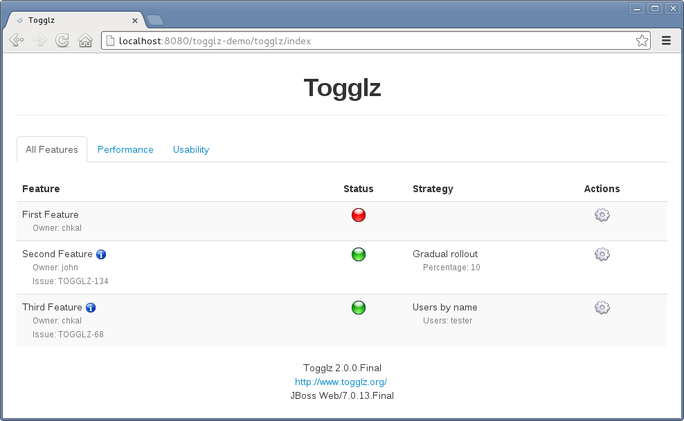

!SLIDE new-chapter center

# Typical Continuous Delivery Practices

!SLIDE

* everything in version control
* comprehensive configuration management
* excellent automated testing at all levels
* continuous integration

~~~SECTION:notes~~~

# Lead Time from "Code Committed" to "Ready To Ship"

- 5% of Development time spent writing new features
- 15 - 20% of Development time was spent integrating their code into mainline (i.e. trunk)

<small>[Source](http://itrevolution.com/the-amazing-devops-transformation-of-the-hp-laserjet-firmware-team-gary-gruver/#)</small>

~~~ENDSECTION~~~

!SLIDE

!SLIDE

!SLIDE incremental

# Commit stage

* Run against every check-in
* Creates a release candidate
* If it fails, fix it immediately

!SLIDE incremental

# Acceptance stage

* End-to-end tests in production-like environment
* Triggered whenever commit tests pass

!SLIDE incremental

# Manual stages

* UAT, staging, integration, production
* Deployments self-serviced using push-button process

!SLIDE incremental

# Practices

* only build your binaries once
* deploy the same way to every environment
* smoke test your deployments
* keep your environments similar
* if anything fails, stop the line

!SLIDE

# Versioned Artefacts

* app-v0.0.147.zip
* app-v0.0.148.zip
* app-v0.0.149.zip

*Use [Semantic Versioning](http://semver.org/)!*

!SLIDE

# Versioned Artefacts

!SLIDE

# Versioned Artefacts

!SLIDE

# External Environment Configuration

!SLIDE

# External Environment Configuration

!SLIDE

# External Environment Configuration

!SLIDE

# External Environment Configuration

!SLIDE

# External Environment Configuration

!SLIDE

# External Environment Configuration

!SLIDE

# Short Lived Feature Branches

*Cleanup to avoid technical debt!*

!SLIDE

# Feature Toggles

*Cleanup to avoid technical debt!*

!SLIDE

# Feature Toggles Example

<code>
if( MyFeatures.FEATURE_ONE.isActive() ) {
  // execute code for new feature
}
</code>

*Cleanup to avoid technical debt!*

!SLIDE

# Feature Toggles Dashboard

*Cleanup to avoid technical debt!*

~~~SECTION:notes~~~

http://webdevnights.github.io/feature-flipping/

Implementations:

Ruby
Flip github.com/pda/flip
Rollout github.com/jamesgolick/rollout
Degrade github.com/jamesgolick/degrade

PHP
FeatureToggle (Symfony) github.com/marekkalnik/FeatureToggleBundle

Python
Gargoyle (Django) github.com/disqus/gargoyle
Django Waffle (Django) github.com/jsocol/django-waffle

Java
http://www.togglz.org/quickstart.html

JavaScript
FeatureFlipperJS (Node)
github.com/bigodines/feature-flipper-js

.net
FeatureToggle
github.com/jason-roberts/FeatureToggle

Groovy
GrailsFeatureToggle
github.com/ryannorris/grails-feature-toggle

~~~ENDSECTION~~~

!SLIDE

# Inside Out Development

!SLIDE

# Deployment Strategies

* Push Button Release
* Separate Deployments from Releases
* Roll Forward

!SLIDE

# Canary Releases
→ release to subset of customer

!SLIDE

!SLIDE

# Blue Green Deployments
→ zero-downtime deployments

!SLIDE

!SLIDE

!SLIDE

!SLIDE

!SLIDE

# Database Changes

* provide backwards compatibility
* branch by abstraction (2-Write, 1-Read)
* lazy migrations (Add, not alter; Remove when safe)

!SLIDE

